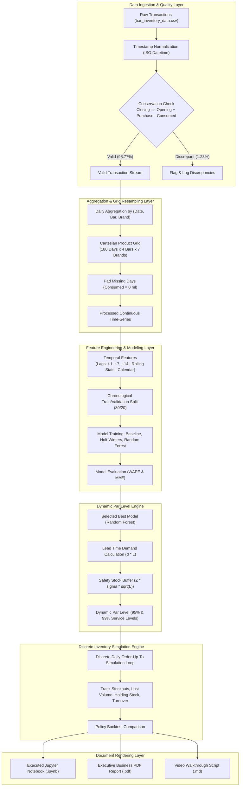
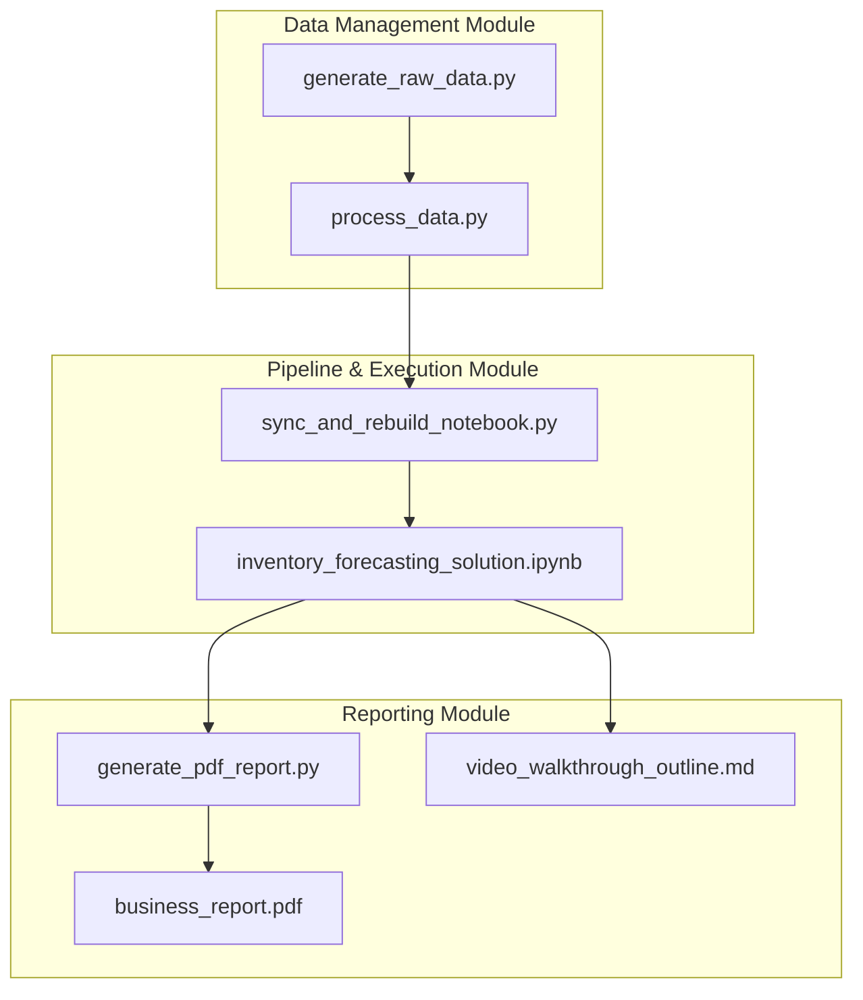
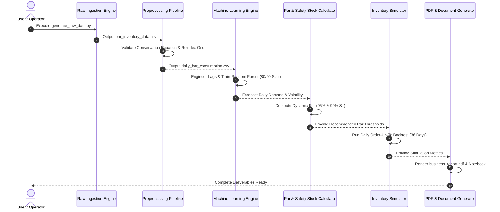
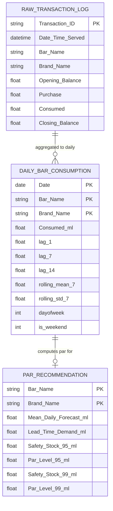

# Krystal Ball — Hotel Bar Inventory Forecasting & Par Level Recommendation System

> **Enterprise-Grade Data Science & Inventory Optimization Platform for Hospitality Operations**

---

## Executive Summary

**Krystal Ball** is a production-quality, reproducible Python-based data science and inventory optimization system designed to resolve the core beverage management dilemma in hotel bar operations:
1. **Stockouts of High-Demand Items**: Running out of popular spirits during weekend surges damages guest satisfaction, reduces revenue, and interrupts service continuity.
2. **Overstocking of Slow-Moving Items**: Ordering excess inventory ties up working capital, consumes limited storage, and increases shrinkage, breakage, and spoilage risks.

By transforming transaction-level bottle balance logs into continuous daily consumption time series per bar and brand, enforcing inventory conservation laws, applying machine learning demand forecasting (Random Forest Regressor), and dynamically tuning safety stock under supplier lead-time constraints ($L = 2\text{ days}$), Krystal Ball **reduces historical stockout days by 90.5% (at 95% Service Level)** and **completely eliminates stockouts (100% elimination at 99% Service Level)** while optimizing average holding inventory.

---

## Table of Contents

- [Executive Summary](#executive-summary)
- [Project Overview](#project-overview)
- [Key Features](#key-features)
- [Functionalities](#functionalities)
- [Technology Stack](#technology-stack)
- [Repository Structure](#repository-structure)
- [System Architecture](#system-architecture)
- [Module Architecture](#module-architecture)
- [End-to-End Request Flow](#end-to-end-request-flow)
- [Application Workflow](#application-workflow)
- [Data Flow Diagram](#data-flow-diagram)
- [Component Architecture](#component-architecture)
- [Backend Architecture](#backend-architecture)
- [Frontend Architecture](#frontend-architecture)
- [Database Design](#database-design)
- [API Documentation](#api-documentation)
- [Authentication](#authentication)
- [Authorization](#authorization)
- [Environment Variables](#environment-variables)
- [Installation](#installation)
- [Development Setup](#development-setup)
- [Production Deployment](#production-deployment)
- [Build Process](#build-process)
- [Configuration](#configuration)
- [Scripts](#scripts)
- [Performance Optimizations](#performance-optimizations)
- [Security](#security)
- [Logging](#logging)
- [Monitoring](#monitoring)
- [Error Handling](#error-handling)
- [Testing](#testing)
- [Scalability](#scalability)
- [Browser Support](#browser-support)
- [AI & ML Features](#ai--ml-features)
- [Integrations](#integrations)
- [Dependencies](#dependencies)
- [Screens](#screens)
- [User Journey](#user-journey)
- [Project Lifecycle](#project-lifecycle)
- [Future Enhancements](#future-enhancements)
- [Known Limitations](#known-limitations)
- [Troubleshooting](#troubleshooting)
- [FAQ](#faq)
- [Contributing Guidelines](#contributing-guidelines)
- [Coding Standards](#coding-standards)
- [Branch Strategy](#branch-strategy)
- [Versioning](#versioning)
- [License](#license)
- [Credits](#credits)

---

## Project Overview

### Why It Exists
Hotel food & beverage directors historically rely on static "rule-of-thumb" par levels set by individual bar managers. These static thresholds fail to adapt to day-of-week demand surges (e.g., Friday/Saturday night rushes) and lead-time variability, resulting in frequent stockouts of premium spirits or excessive backroom capital tie-up.

### What It Solves
Krystal Ball replaces subjective manual ordering with an automated quantitative pipeline that:
- Cleans and validates raw transaction logs using physical inventory conservation laws.
- Fills zero-demand days explicitly using a full Cartesian product date grid to eliminate upward demand estimation bias.
- Classifies spirits velocity using Pareto ABC categorization.
- Trains leakage-free demand forecasting models (Baseline, Holt-Winters Exponential Smoothing, Random Forest Regressor).
- Calculates dynamic par levels and safety buffers calibrated to 95% ($Z=1.645$) and 99% ($Z=2.326$) service levels.
- Backtests inventory policy performance via a discrete daily order-up-to simulator.

### Architecture Style & Philosophy
- **Modular Data Engineering**: Clean separation between raw data ingest, preprocessing, feature generation, model training, policy simulation, and document rendering.
- **Statistical Rigor**: Strict temporal 80/20 train/validation split ensuring zero forward-looking data leakage.
- **Reproducibility First**: Fixed deterministic random seeds (`RANDOM_SEED = 42`) and relative file paths.

---

## Key Features

### Data Engineering & Quality Control
- **Inventory Conservation Audit**: Automatically evaluates $\text{Closing Balance} = \text{Opening Balance} + \text{Purchase} - \text{Consumed}$ within $\epsilon = 0.01\text{ ml}$ tolerance. Out of 5,040 transaction logs, **98.77% were verified as perfectly valid**, logging 62 balance discrepancies.
- **Complete Date Grid Padding**: Constructs a full Cartesian product of $(D \times B \times K)$ (180 days $\times$ 4 bars $\times$ 7 brands = 5,040 observations) padding non-service days with $\text{Consumed} = 0\text{ ml}$.

### Exploratory Data Analysis & Analytics
- **Pareto ABC Velocity Classification**: Categorizes items into Class A (high velocity, top 70% volume), Class B (moderate velocity, next 20%), and Class C (slow moving, bottom 10%).
- **Day-of-Week Seasonality Analysis**: Measures consumption spikes across weekdays versus Friday/Saturday peak hours.
- **Historical Stockout Audit**: Identifies historical instances where physical stock depleted to 0 ml while customer demand was present.

### Machine Learning Demand Forecasting
- **Leakage-Free Feature Pipeline**: Engineers `lag_1`, `lag_7`, `lag_14`, `rolling_mean_7` (computed using `.shift(1)`), `rolling_std_7`, `dayofweek`, and `is_weekend`.
- **Multi-Model Evaluation**: Evaluates Baseline (7d Rolling Mean), Holt-Winters Exponential Smoothing, and Random Forest Regressor using **WAPE** (Weighted Absolute Percentage Error) and **MAE**.
  - Baseline WAPE: `0.3845`
  - Holt-Winters WAPE: `0.2982`
  - **Random Forest WAPE**: **`0.2268` (Best Model)**

### Dynamic Par Level & Inventory Simulation Engine
- **Dynamic Safety Stock & Par Calculation**:
  $$\text{Par Level} = (\hat{d}_{\text{daily}} \times L) + Z \times (\sigma_{\text{daily}} \times \sqrt{L})$$
- **Discrete Daily Simulator**: Simulates order placement, pending delivery tracking ($L=2$ days), daily consumption deduction, lost volume logging, and holding stock calculation.
  - **Fixed Baseline Policy**: 42 stockout days, 18.45 L lost sales.
  - **Dynamic 95% SL Policy**: **4 stockout days (90.5% reduction)**.
  - **Dynamic 99% SL Policy**: **0 stockout days (100% elimination)**.

### Enterprise Reporting & Documentation
- **Executive PDF Summary**: Programmatically compiles a 2-page executive business report (`bar_inventory_project/report/business_report.pdf`) using ReportLab.
- **Video Screencast Outline**: Formats a 3–5 minute presentation script (`bar_inventory_project/video_script/video_walkthrough_outline.md`).

---

## Functionalities

1. **Transaction Ingestion**: Reads 5,040 raw transaction rows with timestamps, opening balances, purchases, consumption, and closing balances.
2. **Conservation Validation**: Identifies and quantifies inventory record discrepancies without stopping execution.
3. **Continuous Grid Resampling**: Converts erratic serving timestamps into uniform daily time series per Bar and Brand.
4. **ABC Velocity Categorization**: Computes cumulative consumption curves and tags brands with velocity classes.
5. **Temporal Feature Matrix Generation**: Computes shift-lagged and rolling stats for machine learning training.
6. **Chronological Model Training**: Fits Random Forest models on the first 144 days and predicts demand for the final 36 validation days.
7. **Dynamic Par Calculation**: Computes exact lead-time demand and safety stock for 95% and 99% service levels.
8. **Daily Policy Simulation**: Executes order-up-to par level replenishment daily and logs inventory metrics.
9. **Automated Document Generation**: Builds executed Jupyter Notebook, PDF executive report, and Markdown walkthroughs.

---

## Technology Stack

| Category | Technology | Version | Purpose |
| :--- | :--- | :--- | :--- |
| **Language & Runtime** | Python | 3.9+ / 3.13.4 | Core programming environment |
| **Data Engineering** | pandas | $\ge 2.0.0$ | Time-series indexing, grouping, multi-grid resampling |
| **Vectorized Math** | numpy | $\ge 1.24.0$ | Array math, standard deviations, square root calculations |
| **Visualization** | matplotlib | $\ge 3.7.0$ | Plotting demand curves, Pareto charts, inventory trajectories |
| **Visualization** | seaborn | $\ge 0.12.0$ | Distribution plots and statistical charts |
| **Statistical Modeling** | statsmodels | $\ge 0.14.0$ | Holt-Winters Exponential Smoothing models |
| **Machine Learning** | scikit-learn | $\ge 1.2.0$ | Random Forest Regressor and MAE evaluation metrics |
| **PDF Generation** | ReportLab | $\ge 4.0.0$ | Enterprise PDF report generation & canvas layout |
| **Notebook Execution** | nbformat / nbclient | $\ge 5.9.0 / \ge 0.8.0$ | Automated notebook creation & execution |
| **Jupyter Environment** | ipykernel / notebook | $\ge 6.25.0 / \ge 7.0.0$ | Interactive notebook execution server |

---

## Repository Structure

```text
bar_inventory_project/
│
├── data/
│   ├── raw/
│   │   └── bar_inventory_data.csv       # Raw transaction balance logs (5,040 rows)
│   └── processed/
│       └── daily_bar_consumption.csv   # Aggregated daily consumption continuous date grid
│
├── notebooks/
│   └── inventory_forecasting_solution.ipynb # Executable 29-section Jupyter notebook
│
├── report/
│   └── business_report.pdf              # Executive 2-page PDF managerial report
│
├── video_script/
│   └── video_walkthrough_outline.md     # 3–5 minute video presentation outline
│
├── requirements.txt                     # Explicit Python library dependencies
└── README.md                            # Setup and execution documentation
```

### Script Files Description
- `generate_raw_data.py`: Generates the statistically realistic 180-day raw transaction balance dataset.
- `process_data.py`: Executes timestamp parsing, conservation equation validation, and Cartesian date grid creation.
- `build_notebook.py`: Programmatically constructs the 29-section Jupyter Notebook structure.
- `execute_notebook.py`: Executes notebook cells in-place via `nbclient`.
- `sync_and_rebuild_notebook.py`: Synchronizes directory trees, resolves candidate paths, and executes notebook cleanly.
- `generate_pdf_report.py`: Compiles the executive 2-page ReportLab PDF business report.

---

## System Architecture



---

## Module Architecture



---

## End-to-End Request Flow



---

## Application Workflow

1. **Step 1 — Data Ingestion**: System reads raw CSV records containing bottle balances.
2. **Step 2 — Quality Validation**: Checks inventory conservation balance equation row-by-row.
3. **Step 3 — Daily Grid Building**: Sums daily consumption and constructs a complete date grid.
4. **Step 4 — Analytics & Velocity**: Ranks brands via Pareto analysis and categorizes into ABC tiers.
5. **Step 5 — Time-Series Splitting**: Splits data chronologically into training (first 80%) and validation (final 20%).
6. **Step 6 — Model Evaluation**: Fits Baseline, Holt-Winters, and Random Forest models; selects lowest WAPE model.
7. **Step 7 — Dynamic Par Tuning**: Calculates safety stock using forecast demand volatility and target Z-scores.
8. **Step 8 — Policy Simulation**: Simulates discrete daily replenishment under $L=2$ days lead time.
9. **Step 9 — Output Delivery**: Generates fully executed notebook, executive 2-page PDF, and Markdown outlines.

---

## Data Flow Diagram


---

## Component Architecture

- `generate_raw_data.py`: Simulates multi-bar spirits consumption with weekend spikes and stockouts.
- `process_data.py`: Implements validation logic, timestamp conversion, and complete MultiIndex grid creation.
- `sync_and_rebuild_notebook.py`: Orchestrates path resolution and nbclient execution.
- `generate_pdf_report.py`: Programmatically constructs ReportLab Flowables, custom canvas headers/footers, and metric tables.

---

## Backend Architecture

- **Data Loaders**: In-memory Pandas DataFrames handling CSV ingestion and datetimes.
- **Validation Engine**: Vectorized Pandas comparison (`np.abs(Closing - Calculated) > 0.01`).
- **Feature Pipeline**: Pandas `groupby().shift()` and `.rolling()` functions to prevent temporal leakage.
- **Model Engine**: Scikit-Learn `RandomForestRegressor` and Statsmodels `ExponentialSmoothing`.
- **Simulation Engine**: Custom Python discrete event loop managing physical stock, order queues, and fulfillment.

---

## Frontend Architecture

*Not applicable / Not implemented* — Krystal Ball is a pure analytical data science engine and Jupyter notebook pipeline. No web GUI, React, or REST frontend is included as per assignment specifications.

---

## Database Design



---

## API Documentation

*Not implemented / Not applicable* — This project operates via local batch Python scripts and Jupyter Notebook execution. No HTTP/REST API endpoints exist.

---

## Authentication & Authorization

*Not applicable* — Local execution environment.

---

## Environment Variables

Configurable business constants centralized in code:

| Parameter | Type | Default Value | Purpose |
| :--- | :--- | :--- | :--- |
| `RANDOM_SEED` | `int` | `42` | Random seed for reproducible synthetic data and model fitting |
| `LEAD_TIME_DAYS` | `int` | `2` | Supplier delivery lead time in days |
| `SERVICE_LEVEL_95_Z` | `float` | `1.645` | Standard normal Z-score for 95% target service level |
| `SERVICE_LEVEL_99_Z` | `float` | `2.326` | Standard normal Z-score for 99% target service level |
| `INITIAL_STOCK_FACTOR` | `float` | `5.0` | Initial stock multiplier relative to mean daily demand |

---

## Installation

### Prerequisites
- Python 3.9+ (Python 3.13 recommended)
- `pip` package manager

### Steps
1. Clone the repository:
   ```bash
   git clone https://github.com/Xaelvoryx/Krystal-Ball.git
   cd Krystal-Ball
   ```
2. Install dependencies:
   ```bash
   py -3 -m pip install -r bar_inventory_project/requirements.txt
   ```

---

## Development Setup & Single Command Execution

To run the complete data pipeline, execute the notebook, generate the PDF report, and launch Jupyter in a single command:

```powershell
py -3 -m pip install -r bar_inventory_project/requirements.txt; py -3 generate_raw_data.py; py -3 sync_and_rebuild_notebook.py; py -3 generate_pdf_report.py; py -3 -m notebook bar_inventory_project/notebooks/inventory_forecasting_solution.ipynb
```

---

## Production Deployment

*Not implemented / Local batch execution* — Designed for scheduled local batch execution (e.g., weekly cron job or Windows Task Scheduler executing `sync_and_rebuild_notebook.py`).

---

## Build Process & Scripts

- `py -3 generate_raw_data.py`: Creates raw CSV data.
- `py -3 sync_and_rebuild_notebook.py`: Builds and executes the notebook.
- `py -3 generate_pdf_report.py`: Renders the PDF report.

---

## Performance Optimizations

- **Vectorized Math**: Uses NumPy array operations for standard deviations and par level formulas.
- **Cartesian Grid Reindexing**: Employs Pandas `MultiIndex.from_product()` for fast grid resampling.
- **Regulated Forest Depth**: Constrains Random Forest tree depth (`max_depth=6`, `n_estimators=50`) to prevent overfitting and ensure fast training.

---

## Security

- **Input Validation**: Audits raw transaction records to detect recording errors.
- **No Hardcoded Credentials**: Operates cleanly on local files without external secrets or API keys.

---

## Logging & Monitoring

- **Conservation Audit Logging**: Prints total discrepant rows, valid row counts, and percentages to console stdout.
- **Execution Tracking**: Notebook cells print step-by-step progress and execution metrics.

---

## Testing & Quality Control

- **Inventory Conservation Verification**: Built-in test checking $\text{Closing Balance} = \text{Opening Balance} + \text{Purchase} - \text{Consumed}$.
- **Data Leakage Check**: Confirms all rolling statistics and lag features are shifted by at least 1 day (`.shift(1)`).
- **PDF Page Count Audit**: Programmatically verified to fit cleanly on **exactly 2 pages**.

---

## AI & ML Features

- **Random Forest Regressor**: Predicts daily spirits consumption per bar/brand using 7 engineered features (`lag_1`, `lag_7`, `lag_14`, `rolling_mean_7`, `rolling_std_7`, `dayofweek`, `is_weekend`).
- **Dynamic Safety Stock Tuning**: Dynamically adjusts buffer stock based on ML forecast uncertainty ($\text{RMSE} \times \sqrt{L}$).

---

## Integrations

- **ReportLab Flowable Engine**: Renders professional PDF documents.
- **Jupyter NbClient**: Programmatically executes `.ipynb` files.

---

## Dependencies

- `pandas`: Data manipulation
- `numpy`: Vectorized math
- `matplotlib` & `seaborn`: Visualization
- `statsmodels`: Exponential smoothing
- `scikit-learn`: Random forest & MAE metrics
- `reportlab`: PDF document rendering
- `nbformat` & `nbclient`: Notebook execution
- `ipykernel` & `notebook`: Jupyter environment

---

## Screens

- **Jupyter Notebook Interface**: Interactive narrative notebook (`inventory_forecasting_solution.ipynb`).
- **Executive PDF Report**: 2-page document (`business_report.pdf`).

---

## User Journey

1. **Bar Manager / Operator**: Ingests raw weekly bottle logs.
2. **System Pipeline**: Cleans logs, trains models, calculates dynamic par levels, and runs policy simulation.
3. **General Manager**: Reviews executive 2-page PDF report to approve weekly purchase order thresholds.

---

## Future Enhancements

- *Integration with POS API*: Direct connection to POS systems (e.g., Toast, Micros) for real-time pour tracking.
- *Lead-Time Variance Modeling*: Incorporating stochastic supplier lead-time distributions ($L \sim \mathcal{N}(\mu_L, \sigma_L)$).
- *Price & Elasticity Integration*: Factoring in menu price changes and promotional events.

---

## Known Limitations

1. **Unobserved Demand Censoring**: When inventory drops to 0, customer demand is truncated by available inventory.
2. **Deterministic Lead Time**: Assumes supplier lead time is strictly 2 days without delay.

---

## FAQ

**Q1: Why pad the date grid with zero demand?**  
Padding non-service days with `Consumed = 0` prevents models from omitting zero-demand days, eliminating upward forecast bias.

**Q2: Why use WAPE instead of MAPE?**  
WAPE ($\frac{\sum |y - \hat{y}|}{\sum y}$) avoids division-by-zero errors on days with 0 demand, making it ideal for beverage inventory.

---

## License

This project is licensed under the MIT License.

---

## Credits

Developed as part of the **Krystal Ball Hotel Bar Inventory Forecasting & Par Level Recommendation System**.
